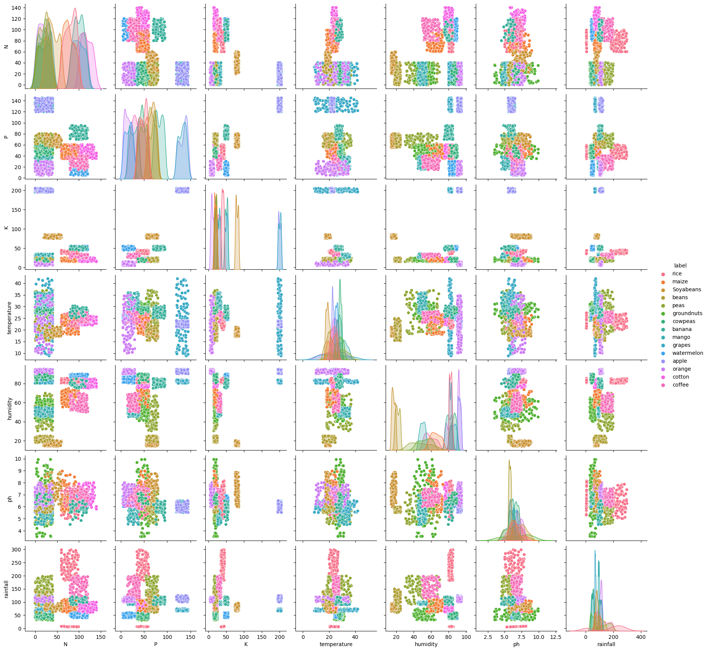
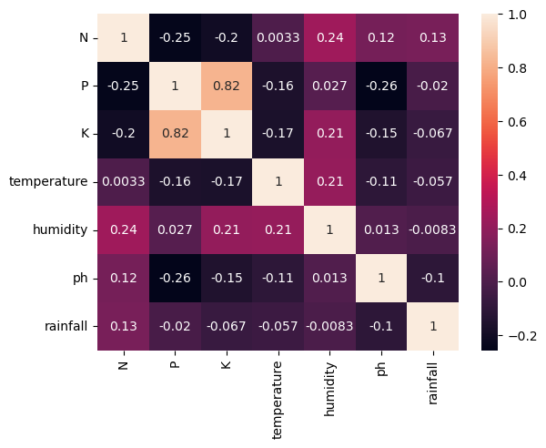

### Data Scientist Blogpost

## Introduction 

*This blogpost is part of Udacity's Data Science Nanodegree program. Details of program can be found at [Udacity](https://www.udacity.com/course/data-scientist-nanodegree--nd025)*


There's no doubt tha COVID-19 brought a lot of disruption to the day to day life for a lot of people. The lockdown and restriction measures slowed virus spreading, but also brought inconvenience to grocery shopping etc. Many people turned to urban farming to be more self-sufficient and more sustainable on food sources.

Now the next questions is what crop to grow? Clearly plants have different preferred growing conditions and this is where we can get some help from data science. In this blog, we will use the crop recommendation dataset from [harvard dataverse](https://dataverse.harvard.edu/dataset.xhtml?persistentId=doi:10.7910/DVN/4GBWFV) to help us select the most appropriate crop in the backyard. 


## Exploratory Data analysis

Let's first have a peek at the dataset after importing it to pandas.

As seen above, the dataset include several growth conditions, including: 
- N (nitrogen)
- P (phosphors)
- K (potassium)
- Temperature
- Humidity
- pH
- Rainfall

And it gives a recommended crop type.

The distribution of the dataset can be visualized as the following pairplot:



The stripplot for each individual feature can help us better understand the distribution of the features.


As show in above, most crops falls in a relative short range of values, with only a few exceptions, like grape/temperature, rice/rainfall, groundnuts/ph. Next we want to ask are there inherently any connection between the columns? The heatmap is a handy tool to visualize the correlation between the variables. 



It's apparent that each column are individual variables without a lot of interactions with the exception betweek potassium and phosphors, maybe they are generally applied in the same compond fertilizer package. However, the humidity data could be related to rainfall and the trend is not observed in the dataset.

## Building models for crop prediction

In this section we will use 4 popular classification algorithms to build a model for crop recommendations. Since this is a single label, multi-output classification task, precision, recall, and f1 score would be used to evaluate the performance metrics.Since the every column in the dataset seems very clustered, KNearest Neighbor and Decision Tree algorithm is appropriate for the task, we will also try two other algorithms, svm classifier and logistic as well. All algorithms will be used with default settings.


## Model interpretation

After fit and evaluation, the metrics can be reviewed through the classification report function from scikit-learn 

```
DecisionTree Classifier
              precision    recall  f1-score   support

   Soyabeans       1.00      1.00      1.00        41
       apple       1.00      1.00      1.00        31
      banana       1.00      1.00      1.00        39
       beans       1.00      1.00      1.00        45
      coffee       1.00      1.00      1.00        29
      cotton       1.00      1.00      1.00        39
     cowpeas       1.00      1.00      1.00        32
      grapes       1.00      1.00      1.00        32
  groundnuts       1.00      1.00      1.00        36
       maize       1.00      1.00      1.00        29
       mango       1.00      1.00      1.00        31
      orange       1.00      1.00      1.00        36
        peas       1.00      1.00      1.00        35
        rice       1.00      1.00      1.00        29
  watermelon       1.00      1.00      1.00        26

    accuracy                           1.00       510
   macro avg       1.00      1.00      1.00       510
weighted avg       1.00      1.00      1.00       510

KNearestNeighbor Classifier
              precision    recall  f1-score   support

   Soyabeans       1.00      1.00      1.00        41
       apple       1.00      1.00      1.00        31
      banana       1.00      1.00      1.00        39
       beans       0.94      1.00      0.97        45
      coffee       1.00      1.00      1.00        29
      cotton       0.97      1.00      0.99        39
     cowpeas       1.00      1.00      1.00        32
      grapes       1.00      1.00      1.00        32
  groundnuts       1.00      0.97      0.99        36
       maize       1.00      0.97      0.98        29
       mango       0.97      1.00      0.98        31
      orange       1.00      1.00      1.00        36
        peas       1.00      0.91      0.96        35
        rice       1.00      1.00      1.00        29
  watermelon       1.00      1.00      1.00        26

    accuracy                           0.99       510
   macro avg       0.99      0.99      0.99       510
weighted avg       0.99      0.99      0.99       510

SVM Classifier
              precision    recall  f1-score   support

   Soyabeans       1.00      1.00      1.00        41
       apple       1.00      1.00      1.00        31
      banana       0.97      1.00      0.99        39
       beans       0.94      1.00      0.97        45
      coffee       1.00      1.00      1.00        29
      cotton       0.95      1.00      0.97        39
     cowpeas       1.00      1.00      1.00        32
      grapes       1.00      1.00      1.00        32
  groundnuts       0.97      0.94      0.96        36
       maize       1.00      0.97      0.98        29
       mango       0.94      1.00      0.97        31
      orange       1.00      1.00      1.00        36
        peas       1.00      0.89      0.94        35
        rice       1.00      0.93      0.96        29
  watermelon       1.00      1.00      1.00        26

    accuracy                           0.98       510
   macro avg       0.98      0.98      0.98       510
weighted avg       0.98      0.98      0.98       510

Logistic Classifier
              precision    recall  f1-score   support

   Soyabeans       1.00      1.00      1.00        41
       apple       1.00      1.00      1.00        31
      banana       0.93      1.00      0.96        39
       beans       0.90      1.00      0.95        45
      coffee       1.00      1.00      1.00        29
      cotton       0.95      0.97      0.96        39
     cowpeas       0.89      1.00      0.94        32
      grapes       1.00      1.00      1.00        32
  groundnuts       1.00      0.67      0.80        36
       maize       1.00      0.97      0.98        29
       mango       0.79      1.00      0.89        31
      orange       1.00      1.00      1.00        36
        peas       1.00      0.86      0.92        35
        rice       1.00      0.76      0.86        29
  watermelon       0.87      1.00      0.93        26

    accuracy                           0.95       510
   macro avg       0.96      0.95      0.95       510
weighted avg       0.96      0.95      0.95       510

Neural Network Classifier
              precision    recall  f1-score   support

   Soyabeans       1.00      1.00      1.00        41
       apple       1.00      1.00      1.00        31
      banana       1.00      1.00      1.00        39
       beans       0.96      1.00      0.98        45
      coffee       1.00      1.00      1.00        29
      cotton       1.00      1.00      1.00        39
     cowpeas       0.97      1.00      0.98        32
      grapes       1.00      1.00      1.00        32
  groundnuts       1.00      0.97      0.99        36
       maize       1.00      1.00      1.00        29
       mango       1.00      1.00      1.00        31
      orange       1.00      1.00      1.00        36
        peas       1.00      0.94      0.97        35
        rice       1.00      1.00      1.00        29
  watermelon       1.00      1.00      1.00        26

    accuracy                           0.99       510
   macro avg       1.00      0.99      0.99       510
weighted avg       0.99      0.99      0.99       510
```


As seen from the graph, the 5 classification methods are all very good at predicting the category in the test set. Intuitively, the features in the data set are all distributed in segments with little to no outliers, logistic regression would be the least suitable method while decision tree method would be the most suitable option.


However, since the models are predicting the test set almost perfectly, this leave us something to think about the data source - is the data source synthetic or simulated? It's not possible to tell from the current dataset.  


## Conclusion

Here we are, if we can get the N, P, K, temperature, humidity, pH, rainfall, it's easy to recommend a crop for the backyard. Happy farming! 


