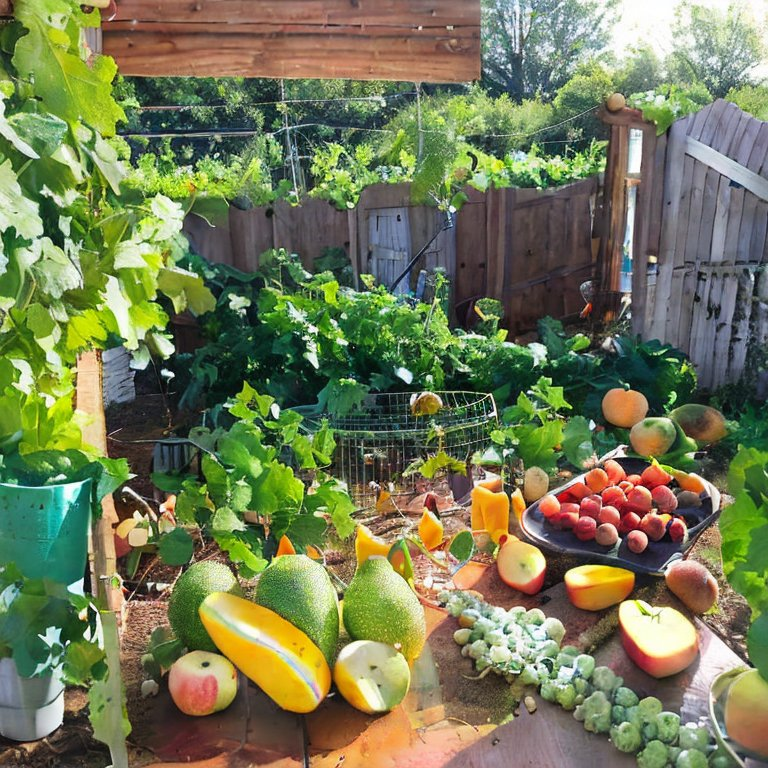
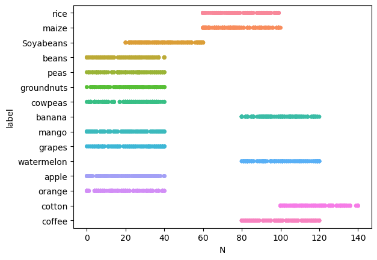
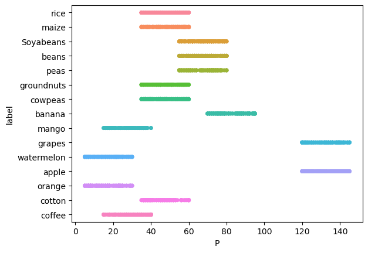
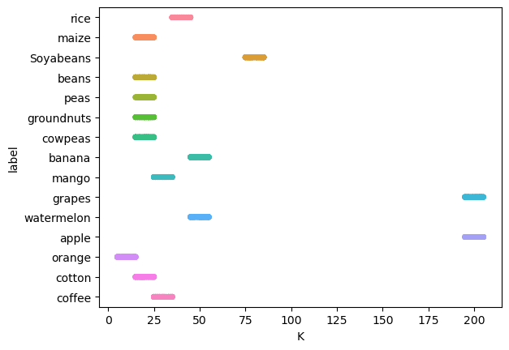
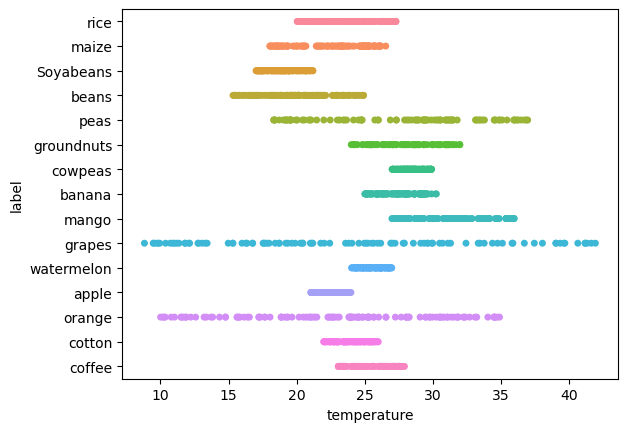
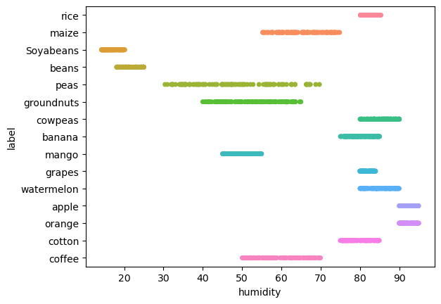
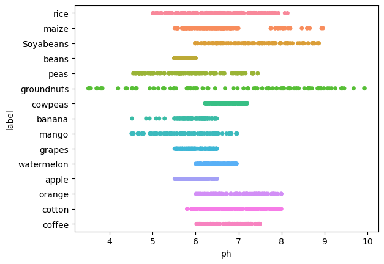
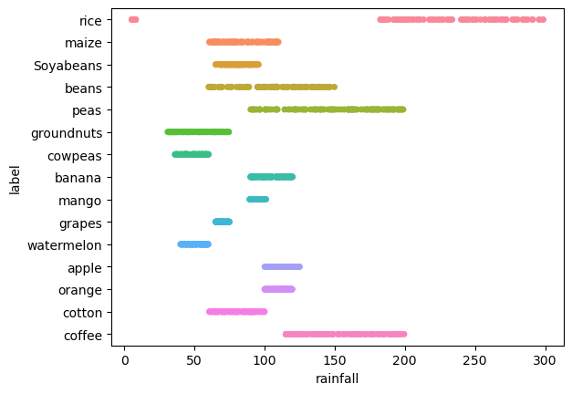
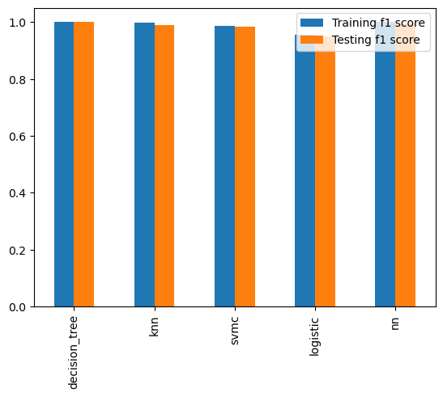

# Backyard Farm Crop Recommendation
Applying CRISP-DM process to solve farming problem.



## Introduction 

*This blogpost is part of Udacity's Data Science Nanodegree program. Details of program can be found at [Udacity](https://www.udacity.com/course/data-scientist-nanodegree--nd025), the project files are hosted on [github](https://github.com/michael3770/Udacity-Data-Science-Nanodegree-Projects/tree/main/Data%20Science%20Blog%20Post). Several minor details have been adjusted for formatting on medium.*


There's no doubt tha COVID-19 brought a lot of disruption to the day to day life for a lot of people. The lockdown and restriction measures slowed virus spreading, but also brought inconvenience to grocery shopping etc. Many people turned to urban farming to be more self-sufficient and more sustainable on food sources.

Now the next questions is what crop to grow? Clearly plants have different preferred growing conditions and this is where we can get some help from data science. In this blog, we will use the crop recommendation dataset from [harvard dataverse](https://dataverse.harvard.edu/dataset.xhtml?persistentId=doi:10.7910/DVN/4GBWFV) to help us select the most appropriate crop in the backyard. 

We will start the analysis of the data using the CRISP-DM (Cross Industry Standard Process for Data Mining), which will use the following steps:

1. Business Understanding
2. Data Understanding
3. Data Preparation and Cleaning
4. Data Modelling
5. Result Evaluation


## Business Understanding

According to the data source, this dataset was made by augmenting optimum soil and environmental characteristics for crop growth. It contains soil and environmental conditions, and the crop that match the condition. Based on the information, we would like to get answer to the following questions -  
 
- What is the most suitable growth condition for each type of plant in the dataset?
- Are there any incompatible plants, where their best growth condition doesn't match?
- Given the growth condition, what is the most recommended crop?

## Exploratory Data analysis and data cleaning

Let's first have a peek at the dataset after importing it to pandas.

As seen above, the dataset include several growth conditions, including: 
- N (nitrogen)
- P (phosphors)
- K (potassium)
- Temperature
- Humidity
- pH
- Rainfall

And it gives a recommended crop type.

First let's take a peek at the provided data, examine if there are missing values, and check the crop category counts. 

First 5 lines of the data -

|    |   N |   P |   K |   temperature |   humidity |      ph |   rainfall | label   |
|---:|----:|----:|----:|--------------:|-----------:|--------:|-----------:|:--------|
|  0 |  90 |  42 |  43 |       20.8797 |    82.0027 | 6.50299 |    202.936 | rice    |
|  1 |  85 |  58 |  41 |       21.7705 |    80.3196 | 7.0381  |    226.656 | rice    |
|  2 |  60 |  55 |  44 |       23.0045 |    82.3208 | 7.84021 |    263.964 | rice    |
|  3 |  74 |  35 |  40 |       26.4911 |    80.1584 | 6.9804  |    242.864 | rice    |
|  4 |  78 |  42 |  42 |       20.1302 |    81.6049 | 7.62847 |    262.717 | rice    |

There does not seem to be missing values in the dataset.

```
N              0
P              0
K              0
temperature    0
humidity       0
ph             0
rainfall       0
label          0
```
The number of data in each crop category is also relatively balanced. 
```
Crop
Soyabeans     130
apple         100
banana        130
beans         125
coffee        110
cotton        100
cowpeas       122
grapes        100
groundnuts    100
maize         119
mango         100
orange        122
peas          100
rice          139
watermelon    100
```
Seems the data publisher has already cleaned and formatted the data very well before publishing.

## Question 1 - What's the suitable growth condition for each crop in the dataset?

There are 13 crops in the dataset, and we want to extract the growth growth condition statistics for each crop.  The plots in next session show the data is distributed pretty uniformly and there does not seem to be outliers. The only exception is rice/rainfall combination, so here I'll focus on the min and max only without discussing about other statical result too much.


| Crop      |   ('N', 'min') |   ('N', 'max') |   ('P', 'min') |   ('P', 'max') |   ('K', 'min') |   ('K', 'max') |   ('temperature', 'min') |   ('temperature', 'max') |   ('humidity', 'min') |   ('humidity', 'max') |   ('ph', 'min') |   ('ph', 'max') |   ('rainfall', 'min') |   ('rainfall', 'max') |
|:-----------|---------------:|---------------:|---------------:|---------------:|---------------:|---------------:|-------------------------:|-------------------------:|----------------------:|----------------------:|----------------:|----------------:|----------------------:|----------------------:|
| Soyabeans  |             20 |             60 |             55 |             80 |             75 |             85 |                 17.025   |                  21.195  |               14.258  |               20.1601 |         5.98899 |         8.86874 |              65.1137  |               95.7099 |
| apple      |              0 |             40 |            120 |            145 |            195 |            205 |                 21.0365  |                  23.9969 |               90.0258 |               94.9205 |         5.51425 |         6.49923 |             100.117   |              124.983  |
| banana     |             80 |            120 |             70 |             95 |             45 |             55 |                 25.0102  |                  30.2679 |               75.0319 |               84.9785 |         4.51909 |         6.49007 |              90.1098  |              119.848  |
| beans      |              0 |             40 |             55 |             80 |             15 |             25 |                 15.3304  |                  24.9236 |               18.0922 |               24.9697 |         5.503   |         5.99812 |              60.2755  |              149.744  |
| coffee     |             80 |            120 |             15 |             40 |             25 |             35 |                 23.0595  |                  27.9237 |               50.0456 |               69.9481 |         6.02095 |         7.49319 |             115.156   |              199.474  |
| cotton     |            100 |            140 |             35 |             60 |             15 |             25 |                 22.0009  |                  25.9924 |               75.0054 |               84.8767 |         5.80105 |         7.99468 |              60.6538  |               99.931  |
| cowpeas    |              0 |             40 |             35 |             60 |             15 |             25 |                 27.0147  |                  29.9145 |               80.035  |               89.9962 |         6.21892 |         7.1995  |              36.1204  |               59.8723 |
| grapes     |              0 |             40 |            120 |            145 |            195 |            205 |                  8.82567 |                  41.9487 |               80.0164 |               83.9835 |         5.51092 |         6.4996  |              65.011   |               74.9151 |
| groundnuts |              0 |             40 |             35 |             60 |             15 |             25 |                 24.0183  |                  31.9993 |               40.0093 |               64.9559 |         3.50475 |         9.93509 |              30.9201  |               74.4433 |
| maize      |             60 |            100 |             35 |             60 |             15 |             25 |                 18.0419  |                  26.5499 |               55.2822 |               74.8291 |         5.5137  |         8.96706 |              60.6517  |              109.752  |
| mango      |              0 |             40 |             15 |             40 |             25 |             35 |                 27.0032  |                  35.9901 |               45.0224 |               54.9641 |         4.50752 |         6.96742 |              89.2915  |              100.812  |
| orange     |              0 |             40 |              5 |             30 |              5 |             15 |                 10.0108  |                  34.9067 |               90.0062 |               94.9642 |         6.01039 |         7.99585 |             100.174   |              119.695  |
| peas       |              0 |             40 |             55 |             80 |             15 |             25 |                 18.3191  |                  36.9779 |               30.4005 |               69.6914 |         4.5482  |         7.44544 |              90.0542  |              198.83   |
| rice       |             60 |             99 |             35 |             60 |             35 |             45 |                 20.0454  |                  27.3008 |               80.1227 |               85.3438 |         5.00531 |         8.14021 |               5.31451 |              298.56   |
| watermelon |             80 |            120 |              5 |             30 |             45 |             55 |                 24.0436  |                  26.986  |               80.0262 |               89.9841 |         6.00098 |         6.95651 |              40.1265  |               59.7598 |


To visualize the growth condition for each crop, some strip plots are rendered below.  Since there are 13 crops and only 7 growth conditions, I will plot the crops to the nutrients to save some space. 















## Question 2 - What Crops are incompatible with each other?

It's apparat from question 1 different crops have different growth conditions and some of the does not overlap. To find out which crops cannot be planted together, we can loop through the crops, then compare the nutrient min/max range across crops. For example, if apple requires minimum 120 P but banana needs max 95 P, they can not be planted together. 

In the implementation, I created a two dimensional matrix by crop_name x crop_name.transpose(), then fill every value in the matrix as 1. If mismatch between two crops were found, the value is set to zero.


|            |   Soyabeans |   apple |   banana |   beans |   coffee |   cotton |   cowpeas |   grapes |   groundnuts |   maize |   mango |   orange |   peas |   rice |   watermelon |
|:-----------|------------:|--------:|---------:|--------:|---------:|---------:|----------:|---------:|-------------:|--------:|--------:|---------:|-------:|-------:|-------------:|
| Soyabeans  |           1 |       0 |        0 |       0 |        0 |        0 |         0 |        0 |            0 |       0 |       0 |        0 |      0 |      0 |            0 |
| apple      |           0 |       1 |        0 |       0 |        0 |        0 |         0 |        0 |            0 |       0 |       0 |        0 |      0 |      0 |            0 |
| banana     |           0 |       0 |        1 |       0 |        0 |        0 |         0 |        0 |            0 |       0 |       0 |        0 |      0 |      0 |            0 |
| beans      |           0 |       0 |        0 |       1 |        0 |        0 |         0 |        0 |            0 |       0 |       0 |        0 |      0 |      0 |            0 |
| coffee     |           0 |       0 |        0 |       0 |        1 |        0 |         0 |        0 |            0 |       0 |       0 |        0 |      0 |      0 |            0 |
| cotton     |           0 |       0 |        0 |       0 |        0 |        1 |         0 |        0 |            0 |       0 |       0 |        0 |      0 |      0 |            0 |
| cowpeas    |           0 |       0 |        0 |       0 |        0 |        0 |         1 |        0 |            0 |       0 |       0 |        0 |      0 |      0 |            0 |
| grapes     |           0 |       0 |        0 |       0 |        0 |        0 |         0 |        1 |            0 |       0 |       0 |        0 |      0 |      0 |            0 |
| groundnuts |           0 |       0 |        0 |       0 |        0 |        0 |         0 |        0 |            1 |       0 |       0 |        0 |      0 |      0 |            0 |
| maize      |           0 |       0 |        0 |       0 |        0 |        0 |         0 |        0 |            0 |       1 |       0 |        0 |      0 |      0 |            0 |
| mango      |           0 |       0 |        0 |       0 |        0 |        0 |         0 |        0 |            0 |       0 |       1 |        0 |      0 |      0 |            0 |
| orange     |           0 |       0 |        0 |       0 |        0 |        0 |         0 |        0 |            0 |       0 |       0 |        1 |      0 |      0 |            0 |
| peas       |           0 |       0 |        0 |       0 |        0 |        0 |         0 |        0 |            0 |       0 |       0 |        0 |      1 |      0 |            0 |
| rice       |           0 |       0 |        0 |       0 |        0 |        0 |         0 |        0 |            0 |       0 |       0 |        0 |      0 |      1 |            0 |
| watermelon |           0 |       0 |        0 |       0 |        0 |        0 |         0 |        0 |            0 |       0 |       0 |        0 |      0 |      0 |            1 |


As shown in the result above, every crop is not compatible with other crop, as the environment and nutrient requirement does not match with each other. 

## Question 3 Given the growth condition, what is the most recommended crop?

In this section we will use 5 popular classification algorithms to build a model for crop recommendations. Since this is a single label, multi-output classification task, precision, recall, and f1 score would be used to evaluate the performance metrics.Since the every column in the dataset seems very clustered, KNearest Neighbor and Decision Tree algorithm is appropriate for the task, we will also try two other algorithms, svm classifier and logistic as well. All algorithms will be used with default settings.

### Model implementation

See the project [github](https://github.com/michael3770/Udacity-Data-Science-Nanodegree-Projects/tree/main/Data%20Science%20Blog%20Post) for implementation details. Every classifier is imported from scikit-learn, and default parameters are used.

### Model evaluation and discussion

After fit and evaluation, the metrics can be reviewed through the classification report function 
```
DecisionTree Classifier
              precision    recall  f1-score   support

   Soyabeans       1.00      1.00      1.00        41
       apple       1.00      1.00      1.00        31
      banana       1.00      1.00      1.00        39
       beans       1.00      1.00      1.00        45
      coffee       1.00      1.00      1.00        29
      cotton       1.00      1.00      1.00        39
     cowpeas       1.00      1.00      1.00        32
      grapes       1.00      1.00      1.00        32
  groundnuts       1.00      1.00      1.00        36
       maize       1.00      1.00      1.00        29
       mango       1.00      1.00      1.00        31
      orange       1.00      1.00      1.00        36
        peas       1.00      1.00      1.00        35
        rice       1.00      1.00      1.00        29
  watermelon       1.00      1.00      1.00        26

    accuracy                           1.00       510
   macro avg       1.00      1.00      1.00       510
weighted avg       1.00      1.00      1.00       510

KNearestNeighbor Classifier
              precision    recall  f1-score   support

   Soyabeans       1.00      1.00      1.00        41
       apple       1.00      1.00      1.00        31
      banana       1.00      1.00      1.00        39
       beans       0.94      1.00      0.97        45
      coffee       1.00      1.00      1.00        29
      cotton       0.97      1.00      0.99        39
     cowpeas       1.00      1.00      1.00        32
      grapes       1.00      1.00      1.00        32
  groundnuts       1.00      0.97      0.99        36
       maize       1.00      0.97      0.98        29
       mango       0.97      1.00      0.98        31
      orange       1.00      1.00      1.00        36
        peas       1.00      0.91      0.96        35
        rice       1.00      1.00      1.00        29
  watermelon       1.00      1.00      1.00        26

    accuracy                           0.99       510
   macro avg       0.99      0.99      0.99       510
weighted avg       0.99      0.99      0.99       510

SVM Classifier
              precision    recall  f1-score   support

   Soyabeans       1.00      1.00      1.00        41
       apple       1.00      1.00      1.00        31
      banana       0.97      1.00      0.99        39
       beans       0.94      1.00      0.97        45
      coffee       1.00      1.00      1.00        29
      cotton       0.95      1.00      0.97        39
     cowpeas       1.00      1.00      1.00        32
      grapes       1.00      1.00      1.00        32
  groundnuts       0.97      0.94      0.96        36
       maize       1.00      0.97      0.98        29
       mango       0.94      1.00      0.97        31
      orange       1.00      1.00      1.00        36
        peas       1.00      0.89      0.94        35
        rice       1.00      0.93      0.96        29
  watermelon       1.00      1.00      1.00        26

    accuracy                           0.98       510
   macro avg       0.98      0.98      0.98       510
weighted avg       0.98      0.98      0.98       510

Logistic Classifier
              precision    recall  f1-score   support

   Soyabeans       1.00      1.00      1.00        41
       apple       1.00      1.00      1.00        31
      banana       0.93      1.00      0.96        39
       beans       0.90      1.00      0.95        45
      coffee       1.00      1.00      1.00        29
      cotton       0.95      0.97      0.96        39
     cowpeas       0.89      1.00      0.94        32
      grapes       1.00      1.00      1.00        32
  groundnuts       1.00      0.67      0.80        36
       maize       1.00      0.97      0.98        29
       mango       0.79      1.00      0.89        31
      orange       1.00      1.00      1.00        36
        peas       1.00      0.86      0.92        35
        rice       1.00      0.76      0.86        29
  watermelon       0.87      1.00      0.93        26

    accuracy                           0.95       510
   macro avg       0.96      0.95      0.95       510
weighted avg       0.96      0.95      0.95       510

Neural Network Classifier
              precision    recall  f1-score   support

   Soyabeans       1.00      1.00      1.00        41
       apple       1.00      1.00      1.00        31
      banana       1.00      1.00      1.00        39
       beans       0.96      1.00      0.98        45
      coffee       1.00      1.00      1.00        29
      cotton       1.00      1.00      1.00        39
     cowpeas       0.97      1.00      0.98        32
      grapes       1.00      1.00      1.00        32
  groundnuts       1.00      0.97      0.99        36
       maize       1.00      1.00      1.00        29
       mango       1.00      1.00      1.00        31
      orange       1.00      1.00      1.00        36
        peas       1.00      0.94      0.97        35
        rice       1.00      1.00      1.00        29
  watermelon       1.00      1.00      1.00        26

    accuracy                           0.99       510
   macro avg       1.00      0.99      0.99       510
weighted avg       0.99      0.99      0.99       510
```




As seen from the graph, the 5 classification methods are all very good at predicting the category in the test set. Intuitively, the features in the data set are all distributed in segments with little to no outliers, logistic regression would be the least suitable method while decision tree method would be the most suitable option.

## Discussion

We have extracted information from this dataset and answered the questions that's going to help our urban farming adventures. We know what to how to cater to a specific crop, and how to select crop based on the conditions. 

After all the questions, I began to think twice about the dataset, and feel like it's simulated. For example, the distribution of conditions for a given crop seems very perfect and there doesn't seems to be missing value or outliers. In some columns, there are more decimals than a typical field measurement. I don't have more information about the data source, nonetheless, the process and method used in this project can apply to many other datasets. 


