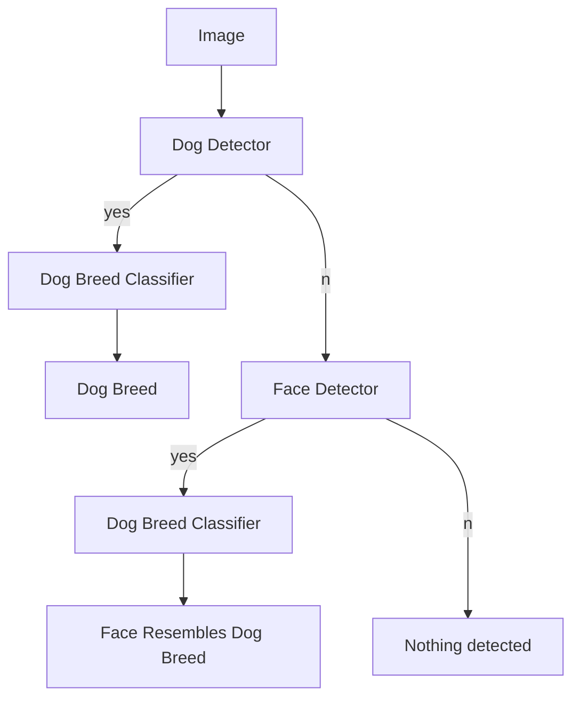
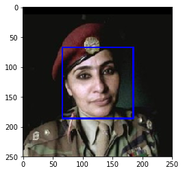
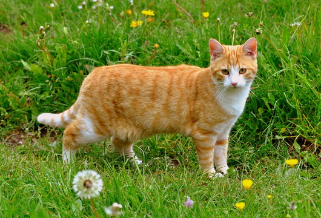
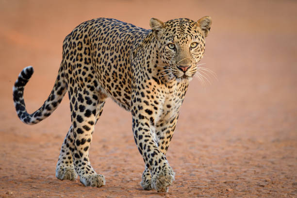

# Dog Breed Prediction Classifier  

*This is a capstone project of Udacity's Data Scientist Nanodegree program*
  
## 1. Introduction

The purpose of this project is to build a dog breed classifier from a set of images containing different kinds of dog breed. After finishing the classifier, user would be able to input a image into the classifier, if there's a dog in the image, the classifier will try to predict the breed of the dog. If there's a human face in the image, the classifier will try to predict which dog breed the human face resembles to. If the image doesn't contain dog or human images, the classifier will return error. The logic flow looks like the following diagram.


Based on the flow, there are several modules we need to take care of
- Human Face Detector - for detecting if the image contains a human face
- Dog Detector - for detecting if the image contains a dog
- Dog Breed Predictor - for predicting the breed of the dog found in the image


## 2. Human Face Detector

There are many methods and models to detect human faces. In this project, the Haar Cascade method is used for face detection. It is a machine learning based approach, and OpenCV has a pre-trained model in xml format for download. To get more information about the model, see the documentation from [OpenCV](https://docs.opencv.org/4.x/db/d28/tutorial_cascade_classifier.html).

The code snippet is provided by Udacity. It loads the pre-downloaded xml file containing the model, then convert images into gray to make a prediction. If faces are detected, the model will return the coordinates of the face, then the image is rendered by pyplot.


```python
import cv2                
import matplotlib.pyplot as plt                        
%matplotlib inline                               

# extract pre-trained face detector
face_cascade = cv2.CascadeClassifier('haarcascades/haarcascade_frontalface_alt.xml')

# load color (BGR) image
img = cv2.imread(human_files[3])
# convert BGR image to grayscale
gray = cv2.cvtColor(img, cv2.COLOR_BGR2GRAY)

# find faces in image
faces = face_cascade.detectMultiScale(gray)

# print number of faces detected in the image
print('Number of faces detected:', len(faces))

# get bounding box for each detected face
for (x,y,w,h) in faces:
    # add bounding box to color image
    cv2.rectangle(img,(x,y),(x+w,y+h),(255,0,0),2)
    
# convert BGR image to RGB for plotting
cv_rgb = cv2.cvtColor(img, cv2.COLOR_BGR2RGB)

# display the image, along with bounding box
plt.imshow(cv_rgb)
plt.show()
```

The output of the code snippet has returned 1 face count. The output over-layed a box indicating where face is detected.




## 3. Dog Detector

For the dog face detector, we rely in a pre-trained model named Resnet-50. Resnet-50 is a 50-layer deep neural network model comprised of 48 convolution layer, 1 maxpool and 1 average pool layer. It has been trained on over a million images and can put the image into 1000 categories. The detailed network architecture of Resnet-50 can be seen [here](https://ethereon.github.io/netscope/#/gist/db945b393d40bfa26006).

**Data Processing for Neural Network models**

It is a bit more involved to use the pre-trained Resnet-50 model compared to the HaarCascade model. Based on the instruction outlined in the notebook, the steps for image processing include
- Convert images into a square shape with 224 pixels by 224 pixels
- Since the image color is represented by RGB, the image is converted to a (1, 224, 224, 3) tensor 
- With Keras api, the images are then stacked to form a 4D tensor, with the shape of (samples, rows, columns, channels), where the rows, columns, channels come from each individual image and the samples are multiple images stacked together
  

```python
from keras.preprocessing import image                  
from tqdm import tqdm

def path_to_tensor(img_path):
    # loads RGB image as PIL.Image.Image type
    img = image.load_img(img_path, target_size=(224, 224))
    # convert PIL.Image.Image type to 3D tensor with shape (224, 224, 3)
    x = image.img_to_array(img)
    # convert 3D tensor to 4D tensor with shape (1, 224, 224, 3) and return 4D tensor
    return np.expand_dims(x, axis=0)

def paths_to_tensor(img_paths):
    list_of_tensors = [path_to_tensor(img_path) for img_path in tqdm(img_paths)]
    return np.vstack(list_of_tensors)
```

For the specific Resnet-50 trained on imagenet, the model output returns a integer representing a category, and all dog categories have integer values between 151 and 268. 
```python
def dog_detector(img_path):
    prediction = ResNet50_predict_labels(img_path)
    return ((prediction <= 268) & (prediction >= 151)) 
```

## 4. Performance of the face detector and dog detector

The performance of the face detector and dog detector can be evaluated by taking the first 100 images of the human images and dog images through the human face detector and dog detector function. The results are shown in the following table: 

| Images                    | Dogs detected | Faces detected|
| :---                      |    :----:     |          ---: |
| First 100 human images    | 0             | 100           |
| First 100 dog images      | 100           | 11            |

As seen from the result, the face detector based on HaarCascade has 11% of the dog images mislabelled, while the Restnet-50 based dog detector correctly labelled every image in the first 100 dog and human files. Although the performance of face detector is not optimal, it's not a big issue in this case. According to the logic flow in section 1, the images will get analyzed by the dog detector first and it has excellent performance. 

## 5. Building a Neural Network from Scratch for the dog breed classification

Our next step would be building a neural network model that can help predicting the breed of dog. The network architecture is comprised of multiple convolution layers and multiple pooling layers. After the final pooling layer, a dense layer is included to match the parameters to the 133 dog categories. 

```
_________________________________________________________________
Layer (type)                 Output Shape              Param #   
=================================================================
conv2d_1 (Conv2D)            (None, 223, 223, 16)      208       
_________________________________________________________________
max_pooling2d_2 (MaxPooling2 (None, 111, 111, 16)      0         
_________________________________________________________________
conv2d_2 (Conv2D)            (None, 110, 110, 32)      2080      
_________________________________________________________________
max_pooling2d_3 (MaxPooling2 (None, 55, 55, 32)        0         
_________________________________________________________________
conv2d_3 (Conv2D)            (None, 54, 54, 64)        8256      
_________________________________________________________________
max_pooling2d_4 (MaxPooling2 (None, 27, 27, 64)        0         
_________________________________________________________________
global_average_pooling2d_1 ( (None, 64)                0         
_________________________________________________________________
dense_1 (Dense)              (None, 133)               8645      
=================================================================
Total params: 19,189
Trainable params: 19,189
Non-trainable params: 0
```

For activation functions, each convolution layer used relu function for computational simplicity, while the last dense layer used softmax function to calculate the probability of the sample falling into each category.

In order to compile the model, rmsprop is used as the optimizer, and categorical cross-entropy is used as the loss function. In order to test the impact on training epochs, 5, 10, 20 epochs are selected and their accuracy is listed in the following graph.

| Epochs    |  Accuracy  |
|:---       |    --:     |
| 5         | 3.3493%    |
| 10        | 3.3974%    |
| 20        | 4.7847%    |

Obviously the increase in training epochs would lead to increased accuracy, but the training time will also increase. This is where we need transfer learning to leverage the power of pre-trained CNN networks to reduce the training time and increase the model accuracy. 

## 6. Using pre-trained neural networks for dog breed classification with transfer learning

Transfer learning, as the name sounds, is using pre-trained model on new targets. Since there are already a large number of pre-trained CNN models for image recognition, the knowledge gathered in pre-trained models can be used to improve our network about similar image recognition tasks. 

In this section, Udacity provided several pre-trained model with bottleneck features, and a template laid out for using VGG16 for transfer learning. I added the VGG19 and Resnet-50 models in the next section, and compared the performance of transfer learning results from all 3 pre-trained models. 

Without introducing too much complexity, a global average pooling layer is added after the pre-trained model and takes the model as input, then a dense layer with softmax function is added to connect the model to the 133 output category. 

The model creation process can be roughly categorized in by the following pseudo code -

```python
#Getting bottleneck features

bottleneck_features = np.load('bottleneck_features/{Pre trained Model}.npz')
train_PretrainedModel = bottleneck_features['train']
valid_PretrainedModel = bottleneck_features['valid']
test_PretrainedModel = bottleneck_features['test']

PretrainedModel_model = Sequential()
PretrainedModel_model.add(GlobalAveragePooling2D(input_shape=train_PretrainedModel.shape[1:]))
PretrainedModel_model.add(Dense(133, activation='softmax'))

```

The network structure and parameters are listed below

**VGG16**
```
_________________________________________________________________
Layer (type)                 Output Shape              Param #   
=================================================================
global_average_pooling2d_2 ( (None, 512)               0         
_________________________________________________________________
dense_2 (Dense)              (None, 133)               68229     
=================================================================
Total params: 68,229
Trainable params: 68,229
Non-trainable params: 0
_________________________________________________________________

```

**VGG19**
```
_________________________________________________________________
Layer (type)                 Output Shape              Param #   
=================================================================
global_average_pooling2d_3 ( (None, 512)               0         
_________________________________________________________________
dense_3 (Dense)              (None, 133)               68229     
=================================================================
Total params: 68,229
Trainable params: 68,229
Non-trainable params: 0
_________________________________________________________________

```

**Resnet50**
```
_________________________________________________________________
Layer (type)                 Output Shape              Param #   
=================================================================
global_average_pooling2d_4 ( (None, 2048)              0         
_________________________________________________________________
dense_4 (Dense)              (None, 133)               272517    
=================================================================
Total params: 272,517
Trainable params: 272,517
Non-trainable params: 0
_________________________________________________________________

```

After compiling the model using rmsprop optimizer and cross categorical entropy loss function, each model is trained for 20 epochs and their accuracy are compared.

|    | VGG-16  | VGG-19 | Resnet-50|
|:---|:---     |:---    |:---      |
| After 20 epoch|34.81%|47.37%|80.50%|


As we can see, Resnet-50 based transfer learning model give prediction results with higher accuracy and it will be saved and used in the prediction tasks in the following sections.

## 7. Implement an algorithm and test the algorithm on sample images

The implementation of the algorithm for sample image classification is relatively straightforward once the previous steps are finished. Here, the image is first rendered in the cell, the fed through a series of detectors shown in the introduction section. 

```python
def render(path):
    '''
    Input - imagefile path
    Output - None, rendering in the notebook cell
    '''
    with Image.open(path) as im:
        display(im)
        
def predict_breed(path):
    '''
    Input - imagefile path
    Output - None. The detection results is printed out inline
    
    '''
    render(path)
    if dog_detector(path):
        print('Predicted breed ' + Resnet50_predict_breed(path).split('.')[-1])
    elif face_detector(path):
        print('This face resembles dog breed ' + Resnet50_predict_breed(path).split('.')[-1])
    else:
        print('Are you sure the image contains a dog or a human?')
    return

```

A number of test images were fed through the algorithm, and here are some responses from the algorithm - 



Are you sure the image contains a dog or a human?



Are you sure the image contains a dog or a human?


This face resembles dog breed Dogue_de_bordeaux


Predicted breed American_water_spaniel


## 8. Discussions

1. The classification result output is better than I expected. This is a model created on transfer learning, and used very little computing resrouce in the training process
    - The classifier is able to distinct other type of animals (cat, lion, leopard) from dogs. This is achieved by directly using Resnet50 pre-trained model imported from keras
    - The classifier is able to detect human faces with OpenCV's Haar Cascade classifier
    - The classifier is able to predict breeds for most of the dog images in the test_image folder. The only exception is it mislabelled American water spaniel to Boykin spaniel, which are two very close breeds.
    - The classifier is also able to predict what kind of dog breed resembles. 
 

2. Improvement ideas:
    - Different pre-trained models. As seen from section 5 transfer learning, the performance of VGG19 and Resnet50 is dramatically different with 20 epochs
    - Different architectures. Neural network with differetn network architectures would lead to different performance
    - Training size in this case has less than 7000 images. More training images, higher resolution images, and data augmentation techniques can be used to improve model accuracy
    - Traing more epochs. Due to time and resrouce constraints, the models in section 5 were only trained with 20 epochs. But as seen in section 4, the models does not seems to be converged at this point and more training epochs can lead to lower loss and higher accuracy. 

## 9. References

Link to my project [repository](https://github.com/michael3770/Udacity-Data-Science-Nanodegree-Projects/tree/main/dog-project).

Link to Udacity's project [repository]((https://github.com/udacity/dog-project)). 


